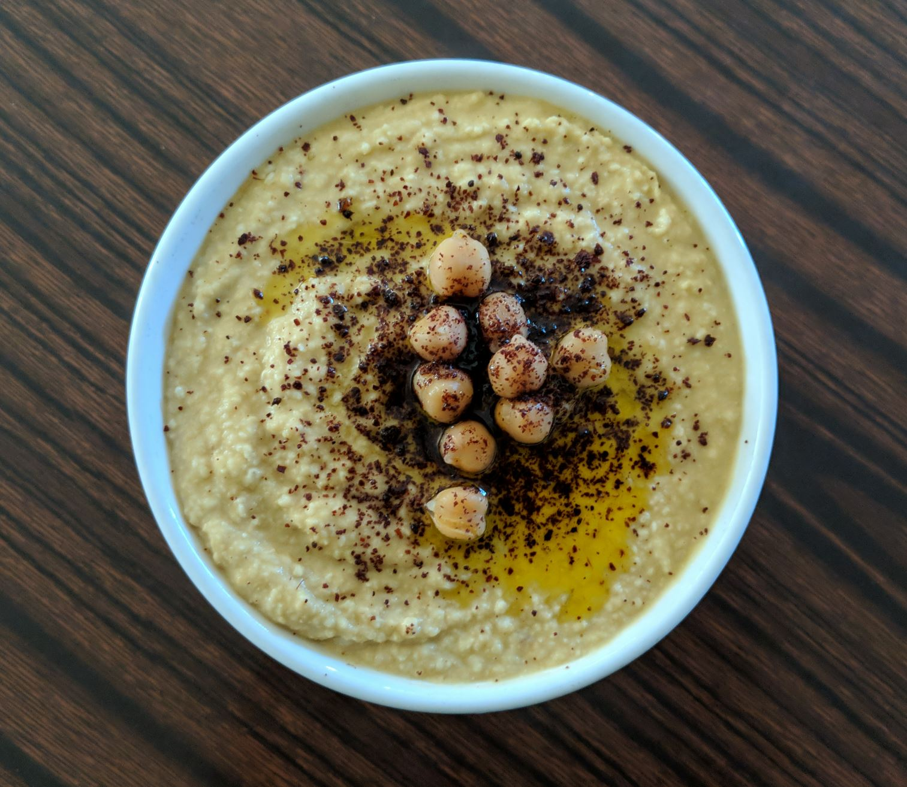

# Hummus Recipe

## Equipment 
- KitchenAid KFC3516 food chopper
- OXO Good Grips 1241581 jar spatula
- Colander
- Non-stick pan
- Measuring cup 250mL
- Shallow bowl 

## Ingredients
- 400g canned chick peas (Edgell)
- 30g sesame seeds
- 50mL olive oil
- 50mL water 
- 40mL freshly squeezed lemon juice (with seeds removed)
- 10g garlic cloves
- 1.5g ground cumin
- 1 tbsp sumac, or to taste 

## Preparation
1. Drain chicken peas using the colander. Rinse off canned water
2. Place some chicken peas into a separate bowl for garnishing
3. Pour chicken peas into the food processor
4. Lightly roast sesame seeds in non-stick pan till golden brown
5. Pour sesame seeds into food processor
6. Place olive oil, water, lemon juice, garlic and cumin into the food processor
7. Run the food processor till hummus has smooth consistency

## Garnishing
1. Scoop out hummus into shallow bowl using the spatula
2. Using a teaspoon swoosh hummus into a spiral pattern
3. Place the separated chicken peas on top
4. Sprinkle sumac 
5. Pour a dash of olive oil 

## Further work 
- Measure exact cumin amount
- Convert volume to mass
- Perhaps slightly more water?
- Garnishing can be better
- Better food photography